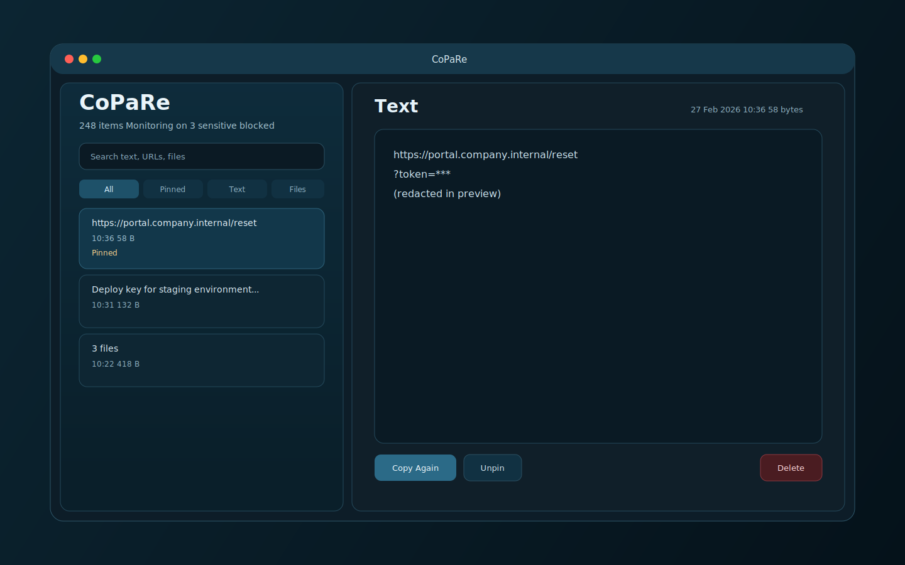
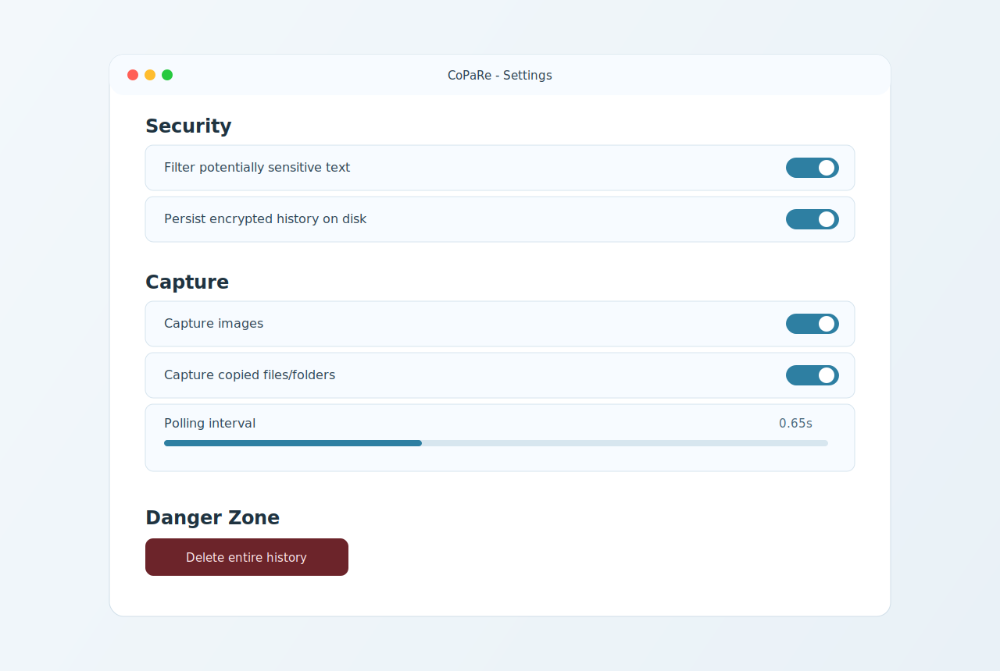
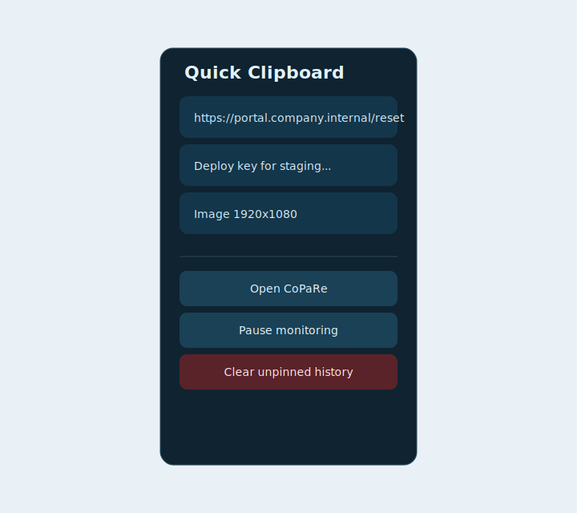

# CoPaRe

CoPaRe is a security-first clipboard manager for macOS.
It keeps a local clipboard history for text, URLs, images, and files with encrypted at-rest storage and practical safe defaults.

## Screenshots

> Note: screenshots below are generated UI previews from this repository (headless environment), included to document the expected interface.

### Main window



### Settings



### Menu bar quick panel



## Core features

- Clipboard history for:
  - Plain text
  - URLs
  - Images (PNG)
  - Files and folders
- Search and filter (`All`, `Pinned`, `Text`, `Images`, `Files`)
- Pin important entries
- Re-copy any item to clipboard
- Menu bar panel with quick re-copy actions
- Private session mode (memory-only, no disk persistence)
- Launch at login support

## Security model

CoPaRe is designed for defense-in-depth, not "perfect secret detection".

### What is implemented

- AES-GCM encryption for history persisted on disk
- Encryption key stored in macOS Keychain
- History file stored under Application Support (`clipboard-history.enc`)
- Sensitive content filter (common secret/token/key patterns)
- Size limits on captured payloads
- No telemetry, tracking, or network calls in app code

### Important limitations

- Clipboard managers cannot guarantee detection of every sensitive value
- Anything copied by other apps may still be exposed in those apps/processes
- If malware already controls the logged-in session, no clipboard manager can fully protect clipboard data

Use CoPaRe as a secure productivity tool, not as a replacement for endpoint hardening.

## Build and run

### Requirements

- macOS
- Xcode 16+ (project currently generated with modern Swift/Xcode settings)

### Build

```bash
xcodebuild -project CoPaRe.xcodeproj -scheme CoPaRe -destination 'platform=macOS' build
```

### Test

```bash
xcodebuild -project CoPaRe.xcodeproj -scheme CoPaRe -destination 'platform=macOS' test
```

## Configuration reference

All options are available in the app Settings view.

| Option | Description | Default |
|---|---|---|
| Filter potentially sensitive text | Blocks likely secrets from being stored | Enabled |
| Persist encrypted history on disk | Enables encrypted local persistence | Enabled |
| Launch at login | Starts CoPaRe automatically at login | Disabled |
| Capture images | Includes copied images in history | Enabled |
| Capture copied files/folders | Includes file URLs in history | Enabled |
| Polling interval | Clipboard polling cadence | 0.65s |
| Unpinned history limit | Max number of non-pinned entries | 250 |

## Repository layout

- `CoPaRe/` - App source code
- `CoPaReTests/` - Unit tests
- `CoPaReUITests/` - UI tests
- `docs/images/` - README visuals

## Open source and contributions

Contributions are welcome.

Recommended flow:

1. Fork the repository.
2. Create a feature branch.
3. Add tests for behavioral changes.
4. Open a PR with a clear security impact summary.

## Security reporting

If you find a security issue, please avoid public disclosure until a fix is available.
Open a private report (or a private issue, depending on your repository policy) with:

- Impact description
- Reproduction steps
- Affected versions/commit
- Suggested mitigation (if available)

## License

Choose and add your preferred OSS license file (`MIT`, `Apache-2.0`, etc.) before public release.

## Release (signed, notarized, DMG)

One command to build, sign, notarize, staple, generate DMG and SHA256, and replace the installed app in `/Applications`.

### Prerequisites

- A valid `Developer ID Application` certificate in your Keychain
- A notary profile already stored in Keychain, for example:

```bash
xcrun notarytool store-credentials "copare-notary" --apple-id "YOUR_APPLE_ID" --team-id "YOUR_TEAM_ID"
```

### Run release script

```bash
cd /path/to/CoPaRe
./scripts/release.sh \
  --sign-identity "Developer ID Application: NAME SURNAME (TEAMID)" \
  --notary-profile "copare-notary"
```

### Useful options

```bash
# custom version used for DMG filename
./scripts/release.sh --sign-identity "..." --notary-profile "copare-notary" --version "1.0.1"

# skip notarization (local smoke build)
./scripts/release.sh --sign-identity "..." --skip-notarize

# keep local app untouched
./scripts/release.sh --sign-identity "..." --notary-profile "copare-notary" --skip-install
```

Generated artifacts:

- `dist/CoPaRe-vX.Y.Z.dmg`
- `dist/CoPaRe-vX.Y.Z.dmg.sha256`
- staged app in `dist/dmg-root/CoPaRe.app`
