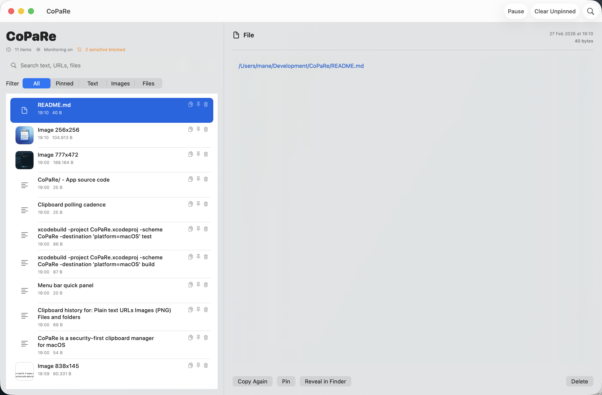
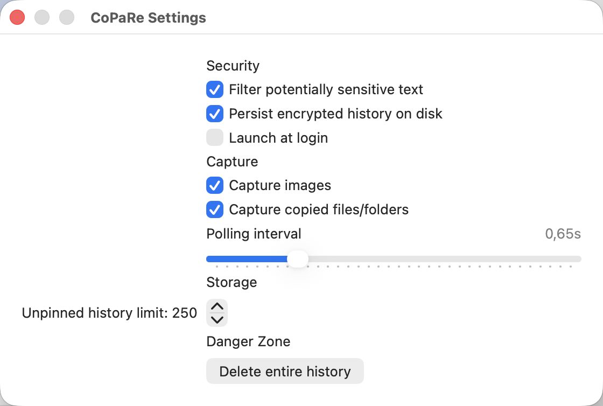
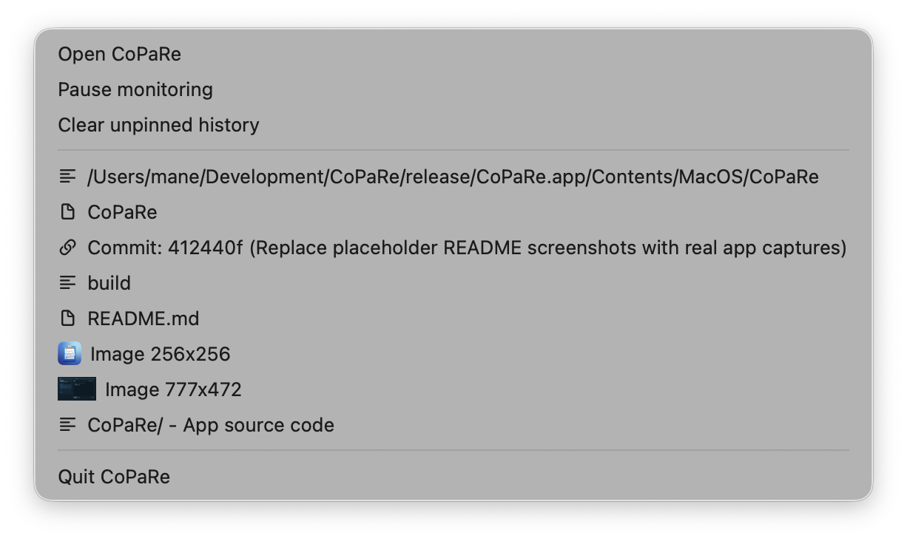

# CoPaRe

CoPaRe is a security-first clipboard manager for macOS.
It stores clipboard history locally with encrypted at-rest persistence and practical safe defaults.

## Screenshots

### Main window



### Settings



### Menu bar quick panel



## Download and install

### Option 1: Use the bundled app (fastest)

This repository includes a ready app bundle:

- `release/CoPaRe.app`

Notes:

- This bundle is built with ad-hoc signature (`Sign to Run Locally`), so it does not contain personal Developer ID metadata.
- On first launch, macOS may require `Right click > Open`.

### Option 2: Build from source

Requirements:

- macOS
- Xcode 16+

Build:

```bash
xcodebuild -project CoPaRe.xcodeproj -scheme CoPaRe -destination 'platform=macOS' build
```

Test:

```bash
xcodebuild -project CoPaRe.xcodeproj -scheme CoPaRe -destination 'platform=macOS' test
```

## Core features

- Clipboard history for text, URLs, images, files, and folders
- Fast search and filters (`All`, `Pinned`, `Text`, `Images`, `Files`)
- Pin/unpin important entries
- One-click re-copy for every entry
- Menu bar panel for quick actions
- Private session mode (memory-only)
- Launch at login

## Security model

CoPaRe is designed with defense-in-depth.

Implemented:

- AES-GCM encryption for local persisted history
- Encryption key stored in macOS Keychain
- Sensitive content filter (common secret/token/key patterns)
- Payload size limits to reduce accidental large captures
- No telemetry or tracking

Limits:

- No clipboard manager can detect every secret with 100% accuracy
- If the logged-in session is compromised, clipboard data can still be exposed

## Configuration reference

| Option | Description | Default |
|---|---|---|
| Filter potentially sensitive text | Blocks likely secrets from being stored | Enabled |
| Persist encrypted history on disk | Enables encrypted local persistence | Enabled |
| Launch at login | Starts CoPaRe automatically at login | Disabled |
| Capture images | Includes copied images in history | Enabled |
| Capture copied files/folders | Includes file URLs in history | Enabled |
| Polling interval | Clipboard polling cadence | 0.65s |
| Unpinned history limit | Max number of non-pinned entries | 250 |

## Signed DMG release flow

For notarized distribution, use:

- `scripts/release.sh`

It performs: release build, app signing, DMG creation/signing, notarization, stapling, validation, and SHA256 generation.

Example:

```bash
./scripts/release.sh \
  --sign-identity "Developer ID Application: NAME SURNAME (TEAMID)" \
  --notary-profile "copare-notary"
```

## Repository layout

- `CoPaRe/` app source
- `CoPaReTests/` unit tests
- `CoPaReUITests/` UI tests
- `docs/images/` README screenshots
- `release/` distributable app bundle for quick install
- `scripts/` release automation

## Contributing

1. Fork the repository.
2. Create a feature branch.
3. Add tests for behavior changes.
4. Open a PR with security impact notes.

## Security reporting

Please avoid public disclosure until a fix is available.
Share:

- impact description
- reproduction steps
- affected version/commit
- suggested mitigation (if available)

## License

Add your preferred OSS license (`MIT`, `Apache-2.0`, etc.) before broad public release.
