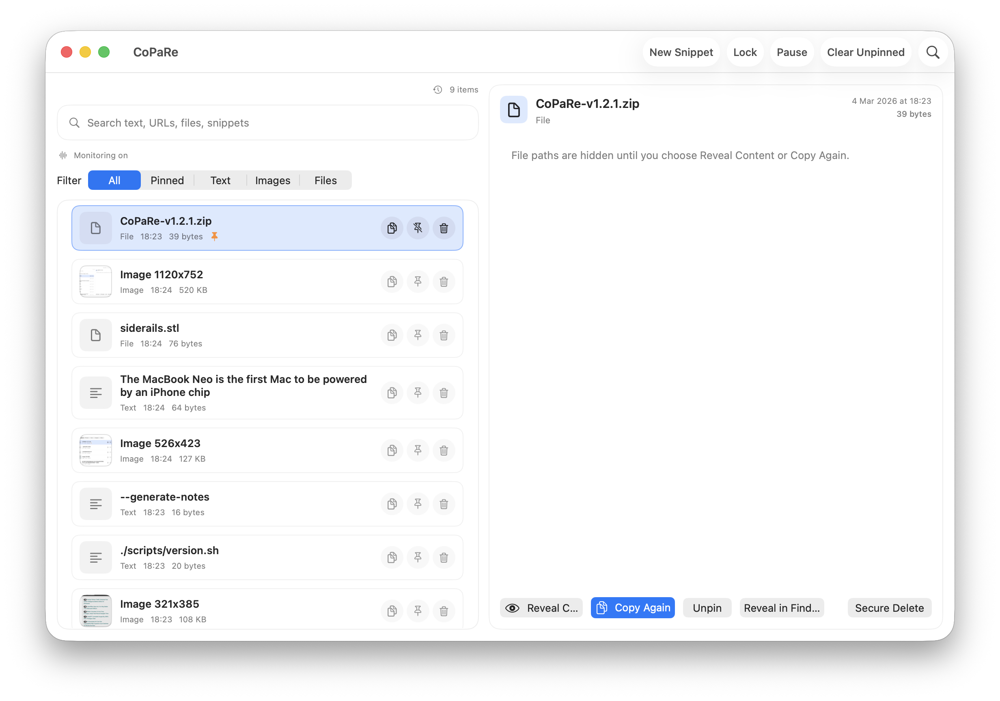
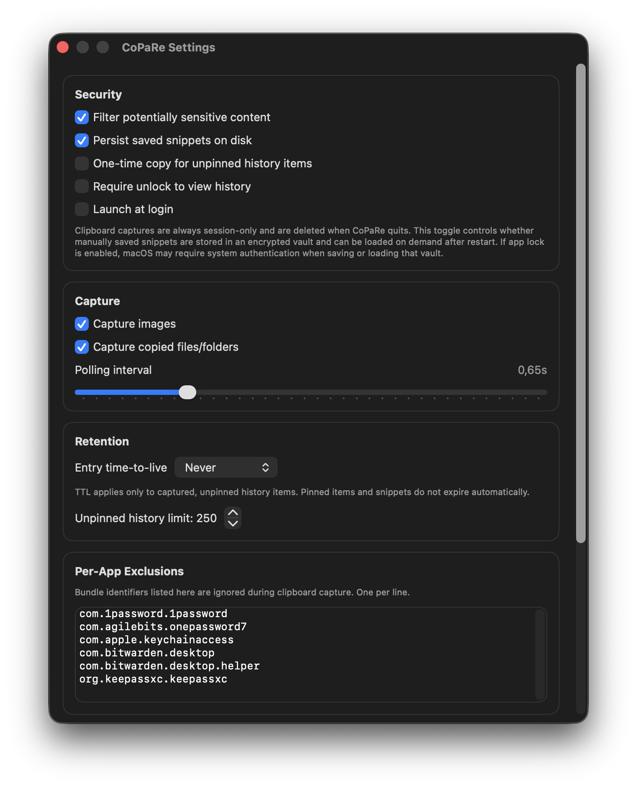
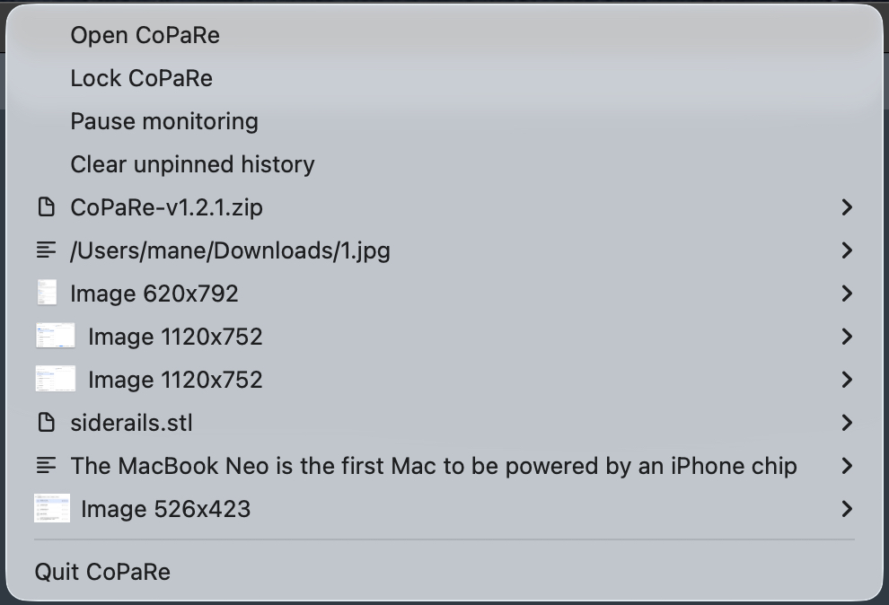

# CoPaRe

CoPaRe is a security-focused clipboard manager for macOS.
It keeps clipboard history local, supports encrypted persistence at rest, and avoids bundling personal signing metadata in the public source repository.

## Screenshots

### Main window



### Settings



### Menu bar quick panel



## Download and install

### Option 1: Use the bundled archive

This repository includes a prebuilt archive in `release/`:

- `release/CoPaRe-v1.0.0.zip`

What it contains:

- `CoPaRe.app`
- ad-hoc signature (`TeamIdentifier=not set`) so no personal Developer ID details are embedded in the public repository
- hardened runtime flag enabled in the bundled app signature
- note: a macOS `.app` is a bundle directory, so for GitHub release assets you should upload a `.zip` or `.dmg`, not the raw bundle

Install:

```bash
mkdir -p /tmp/CoPaRe-install
ditto -x -k release/CoPaRe-v1.0.0.zip /tmp/CoPaRe-install
rm -rf /Applications/CoPaRe.app
cp -R /tmp/CoPaRe-install/CoPaRe.app /Applications/CoPaRe.app
open /Applications/CoPaRe.app
```

Notes:

- Because the bundled archive is not Developer ID notarized, macOS may require `Right click > Open` on first launch.
- If you want a notarized DMG, generate it with `scripts/release.sh` as described below.

### Option 2: Build from source

Requirements:

- macOS
- Xcode 17 or newer

Build:

```bash
xcodebuild -project CoPaRe.xcodeproj -scheme CoPaRe -destination 'platform=macOS' build
```

Test:

```bash
xcodebuild -project CoPaRe.xcodeproj -scheme CoPaRe -destination 'platform=macOS' test
```

## Core features

- Clipboard history for text, URLs, images, files, and folders
- Fast search across visible previews and minimal local file labels
- Filters for `All`, `Pinned`, `Text`, `Images`, and `Files`
- Pin/unpin important entries
- One-click re-copy for every entry
- Menu bar quick panel for fast access
- Private session mode when encrypted persistence is disabled
- Launch at login support on macOS 13+

## Security posture

CoPaRe uses practical hardening appropriate for a local clipboard manager:

- App Sandbox enabled
- Release entitlement `com.apple.security.get-task-allow = false`
- Hardened runtime enabled for release distribution builds produced by `scripts/release.sh`
- AES-GCM encryption for persisted clipboard history
- Encryption key stored in macOS Keychain with `kSecAttrAccessibleWhenUnlockedThisDeviceOnly`
- Full history payload stored encrypted and decrypted on demand for re-copy or focused detail view
- Search avoids indexing full text bodies in RAM; only visible previews and minimal file labels remain searchable
- Protected pasteboard-type detection for concealed/password-manager clipboard content
- Sensitive file-path filtering for likely secret material (`.key`, `.pem`, `.ovpn`, `.ssh`, `.gnupg`)
- Focused detail payload cleared when the app resigns active and after a short timeout
- No analytics or outbound telemetry code in the app source

## Security model limits

- No clipboard manager can reliably detect every secret copied by a user.
- The optional search experience is intentionally narrower than traditional clipboard managers because CoPaRe avoids retaining full plaintext bodies in RAM for global indexing.
- If the logged-in macOS session is already compromised, clipboard contents can still be exposed.
- CoPaRe is not a replacement for OS hardening, endpoint protection, or account security.

## Verify security locally

Validate an installed app:

```bash
./scripts/security-check.sh /Applications/CoPaRe.app
```

Or build a fresh local Release bundle and verify it automatically:

```bash
./scripts/security-check.sh
```

Additional details: see [SECURITY.md](SECURITY.md).

## Signed DMG release flow

Use `scripts/release.sh` when you want a signed distribution DMG.

The script:

- builds a Release app
- signs the app with your `Developer ID Application` certificate
- validates security entitlements
- optionally installs the app to `/Applications`
- creates a DMG in `dist/`
- signs the DMG
- optionally notarizes and staples it
- generates a SHA256 file next to the DMG

Example:

```bash
./scripts/release.sh \
  --sign-identity "Developer ID Application: NAME SURNAME (TEAMID)" \
  --notary-profile "copare-notary"
```

Typical outputs:

- `dist/CoPaRe-v1.0.0.dmg`
- `dist/CoPaRe-v1.0.0.dmg.sha256`

## Configuration reference

| Option | Description | Default |
|---|---|---|
| Filter potentially sensitive text | Blocks likely secrets and sensitive file paths from being stored | Enabled |
| Persist encrypted history on disk | Enables encrypted local persistence | Enabled |
| Launch at login | Starts CoPaRe automatically at login (macOS 13+) | Disabled |
| Capture images | Includes copied images in history | Enabled |
| Capture copied files/folders | Includes file URLs in history | Enabled |
| Polling interval | Clipboard polling cadence | 0.65s |
| Unpinned history limit | Maximum number of non-pinned entries kept | 250 |

## Repository layout

- `CoPaRe/` app source
- `CoPaReTests/` unit tests
- `CoPaReUITests/` UI tests
- `docs/images/` screenshots used in this README
- `release/` prebuilt public archive included in the repository
- `scripts/` release automation and security verification helpers
- `LICENSE` Apache 2.0 license text with the Commons Clause restriction
- `NOTICE` attribution and license notice that redistributions must keep

## Contributing

1. Fork the repository.
2. Create a feature branch.
3. Add tests for behavior changes where practical.
4. Include security impact notes in your pull request.

## Security reporting

Please avoid public disclosure until a fix is available.

Include:

- impact and attack scenario
- reproduction steps
- affected commit or version
- suggested mitigation (if available)

## License

CoPaRe is distributed under Apache License 2.0 with the Commons Clause License Condition v1.0. See [LICENSE](LICENSE).

This means:

- individuals and companies may use, modify, and integrate the software, including for internal business use
- redistributions must preserve the license and notice files
- you may not sell CoPaRe itself, or a product/service whose value derives substantially from CoPaRe, under the default repository terms

Important:

- this is source-available software, not OSI-approved open source
- if you want an absolute ban on every monetized redistribution scenario, that requires a custom commercial license, not just a stock license text

## Commercial licensing

If you want to resell CoPaRe, offer it as a paid standalone distribution, or build a paid service whose value derives substantially from CoPaRe:

- you need a separate written commercial license from the copyright holders before distribution
- the default repository terms do not grant that resale right
- internal company use remains allowed under the included license terms
