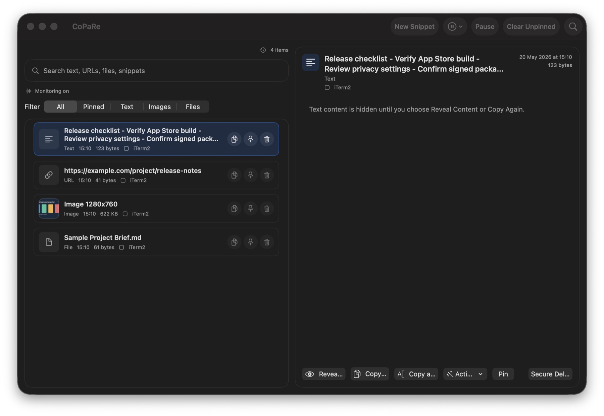
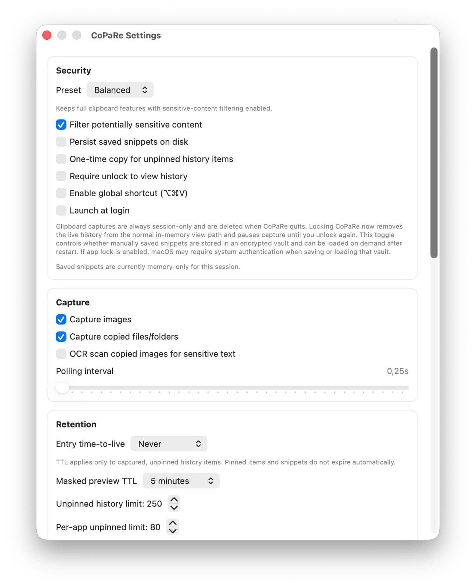
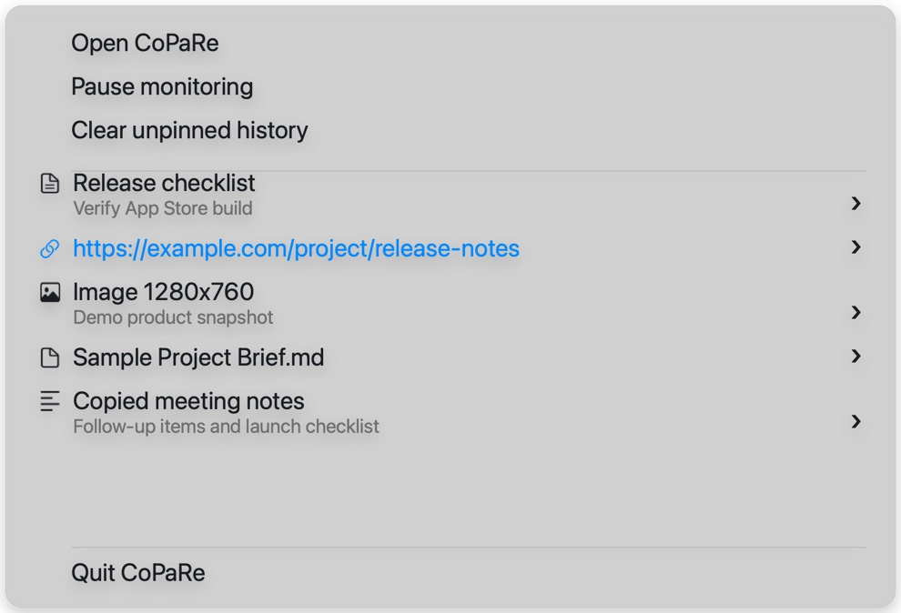

# CoPaRe

CoPaRe is a source-available, privacy-first clipboard manager for macOS.
It keeps captured clipboard history session-only, stores only user-authored snippets across restarts when enabled, and prioritizes secure defaults for everyday work.

[Website](https://copare.boscolo.io/) | [Support](https://copare.boscolo.io/support/) | [Privacy policy](https://copare.boscolo.io/privacy/) | [Latest GitHub release](https://github.com/mane/CoPaRe/releases/latest) | [Changelog](CHANGELOG.md)

## Why CoPaRe

- Security-first design: session-only captured history, encrypted snippet vault, local authentication support
- Practical daily workflow: fast search, menu bar quick panel, global shortcut, one-click copy
- Clear privacy posture: no telemetry, no analytics SDKs, no cloud sync by default
- Production-ready distribution: signed, notarized manual-install build with Sparkle signed updates, plus a separate Mac App Store build flow

## What's new in 1.4.2

- Updated the macOS app icon across all required icon sizes.
- Refreshed App Store listing copy for the new submission.
- Included the latest README, website, screenshot, and repository hygiene updates.

See [CHANGELOG.md](CHANGELOG.md) for the full release history.

## Screenshots

### Main window



### Settings



### Menu bar quick panel



## Download and install

### Install manually from GitHub Release

Use the prebuilt, signed and notarized manual-install package from GitHub Releases:

- [Latest release](https://github.com/mane/CoPaRe/releases/latest)

Step by step:

1. Open the latest release page and download:
   - `CoPaRe-vX.Y.Z.dmg`
   - optional integrity file: `CoPaRe-vX.Y.Z.dmg.sha256`
2. (Optional but recommended) Verify checksum:
   ```bash
   shasum -a 256 CoPaRe-vX.Y.Z.dmg
   ```
   Compare the output with the value in `CoPaRe-vX.Y.Z.dmg.sha256`.
3. Double-click the DMG to mount it.
4. In the same DMG window, drag `CoPaRe.app` onto the bundled `Applications` shortcut.
5. Open `Applications > CoPaRe`.
6. If macOS blocks first launch:
   - open `System Settings > Privacy & Security`
   - click `Open Anyway` for CoPaRe, then confirm once.

After install, CoPaRe can auto-check signed updates from the app menu (`CoPaRe > Check for Updates…`).

The GitHub release is the manual-install build and includes Sparkle updates. The Mac App Store build is prepared separately without Sparkle.

### Build from source

Requirements:

- macOS
- Xcode 17 or newer

Build:

```bash
xcodebuild -project CoPaRe.xcodeproj -scheme CoPaRe -destination 'platform=macOS' build
```

Test:

```bash
xcodebuild -project CoPaRe.xcodeproj -scheme CoPaRe -destination 'platform=macOS' test
```

## Core features

- Clipboard history for text, URLs, images, files, and folders
- First-launch guided "How to" onboarding with key actions and security overview
- Manual snippets with optional encrypted local persistence
- Global launcher shortcut (`⌥⌘V`) with instant search focus
- On-demand loading of the saved-snippets vault (`Load Saved Snippets`)
- Duplicate collapse with capture counters for repeated copies
- Fast search across visible previews and minimal local file labels
- Automatic preview masking for likely secret text/token captures
- Optional OCR scanning of copied images to block likely sensitive text
- Filters for `All`, `Pinned`, `Text`, `Images`, and `Files`
- Pin/unpin important entries
- Source-application label for each captured entry
- Per-app capture exclusions using bundle identifiers
- Entry time-to-live controls for captured, unpinned history items
- Optional one-time copy for unpinned history items
- Optional local lock/unlock gate that removes the active history from the normal in-memory view path, pauses capture while locked, and uses local authentication to restore it
- `userPresence` protection for the saved-snippets vault when app lock is enabled
- One-click re-copy for every entry
- `Copy as Plain Text` for text, URL, and file entries
- Sparkle-based updates with background checks at launch
- Signed appcast feed plus EdDSA-signed update archives
- Sparkle installer flow with one-click verified update prompts
- Manual update check in the macOS app menu (`CoPaRe > Check for Updates…`)
- Menu bar quick panel for fast access
- Menu bar actions for copy, pin/unpin, reveal in Finder, and secure delete
- Session-only clipboard capture with no automatic history-at-rest
- Secure wipe of in-memory history and saved snippets
- Local security event counters for blocked/skipped activity
- Launch at login support on macOS 13+

## Security at a glance

CoPaRe uses practical hardening appropriate for a local clipboard manager:

- App Sandbox enabled
- Release entitlement `com.apple.security.get-task-allow = false`
- Hardened runtime enabled for release distribution builds produced by `scripts/release.sh`
- Captured clipboard history is never written to disk and is cleared when CoPaRe quits
- Runtime payloads are wrapped with an in-memory session key and revealed on demand for re-copy or focused detail view
- Locking CoPaRe temporarily removes the live history from the normal in-memory path, encrypts a short-lived lock snapshot, and pauses clipboard capture until unlock
- Optional snippet persistence stores only user-authored snippets in an encrypted vault stored in the app support container with restrictive local file permissions
- Search avoids indexing full text bodies in RAM; only visible previews and minimal file labels remain searchable, and likely secrets are auto-masked in previews
- Protected pasteboard-type detection for concealed/password-manager clipboard content
- No analytics or outbound telemetry code in the app source

Security limits, verification commands, and vulnerability reporting details are in [SECURITY.md](SECURITY.md).

## Distribution docs

- [Distribution and release workflow](docs/DISTRIBUTION.md)
- [App Store metadata draft](release/APP_STORE_METADATA_en-US.md)
- [App Store submission checklist](release/APP_STORE_SUBMISSION.md)

## Changelog

- See [CHANGELOG.md](CHANGELOG.md) for version-by-version release notes.

## Configuration reference

| Option | Description | Default |
|---|---|---|
| Filter potentially sensitive content | Blocks likely secrets and sensitive file paths from being stored | Enabled |
| Persist saved snippets on disk | Persists only manually created snippets in an encrypted vault; captured clipboard history always stays session-only | Enabled |
| One-time copy for unpinned history items | Removes an unpinned captured item after a successful re-copy | Disabled |
| Require unlock to view history | Locks the visible history behind local authentication and binds saved-snippets vault access to `userPresence` when enabled | Disabled |
| Launch at login | Starts CoPaRe automatically at login (macOS 13+) | Disabled |
| Capture images | Includes copied images in history | Enabled |
| Capture copied files/folders | Includes file URLs in history | Enabled |
| Polling interval | Clipboard polling cadence | 0.65s |
| Entry time-to-live | Auto-expires captured, unpinned items after a selected retention window | Never |
| Unpinned history limit | Maximum number of non-pinned entries kept | 250 |
| Per-App Exclusions | Newline-separated bundle identifiers that CoPaRe ignores during capture | Built-in password manager defaults |

## Additional behavior

- Snippets are manually created text entries and are not subject to automatic TTL expiration.
- Saved snippets are not auto-loaded at app launch; they are loaded only when you explicitly choose `Load Saved Snippets`.
- Re-copied text and URLs are written back to the pasteboard with concealed/auto-generated markers to reduce capture by other well-behaved clipboard tools.
- Pinned items and snippets are preserved when you use the standard "Clear unpinned history" action.
- Captured clipboard history is always memory-only and is not restored after relaunch.
- Secure delete of individual entries removes them from the current session immediately.
- "Secure wipe entire history" removes all items, deletes the encrypted snippets vault file if present, and destroys the snippet encryption keys (crypto-shredding).
- Secure wipe shows a warning if one or more protected Keychain keys cannot be removed (for example if authentication is canceled).
- Security event counters are local-only and track blocked sensitive captures, excluded-app skips, expired entries, secure wipes, and unlock events.

## Repository layout

- `CoPaRe/` app source
- `CoPaReTests/` unit tests
- `CoPaReUITests/` UI tests
- `CoPaRe-Info.plist` explicit app Info.plist containing Sparkle configuration
- `docs/` project documentation and README screenshots
- `release/` signed `appcast.xml`, release notes, App Store metadata, and App Store screenshots; generated Sparkle archives are ignored
- `dist/` locally generated DMGs and checksums created by `scripts/release.sh` (not intended to stay versioned in git)
- `scripts/` versioning, release automation, and security verification helpers
- `LICENSE` CoPaRe Community License 1.0
- `NOTICE` required attribution and origin notice that redistributions must keep

## Contributing

1. Fork the repository.
2. Create a feature branch.
3. Add tests for behavior changes where practical.
4. Include security impact notes in your pull request.

## Security reporting

Please avoid public disclosure until a fix is available.

Include:

- impact and attack scenario
- reproduction steps
- affected commit or version
- suggested mitigation (if available)

## License

CoPaRe is distributed under the CoPaRe Community License 1.0. See [LICENSE](LICENSE).

This means:

- individuals and companies may use, modify, and run the software, including for internal business use
- redistributions in source or binary form are allowed only when they are free of charge
- redistributions must preserve the `LICENSE` and `NOTICE` files
- redistributions must clearly preserve attribution to the CoPaRe project and state whether the software was modified
- no one may generate profit, fees, margins, or other commercial benefit from redistributing CoPaRe or derivative works under the default repository terms

Important:

- this is source-available software, not OSI-approved open source
- commercial redistribution rights are reserved unless the copyright holders grant separate written permission

## Commercial redistribution

If you want to sell CoPaRe, include it in a paid bundle, ship it as part of a paid service, or otherwise monetize redistribution of CoPaRe:

- the default repository terms do not allow that
- you need separate written permission from the copyright holders before distribution
- internal company use that does not redistribute the software remains allowed under the included license terms
